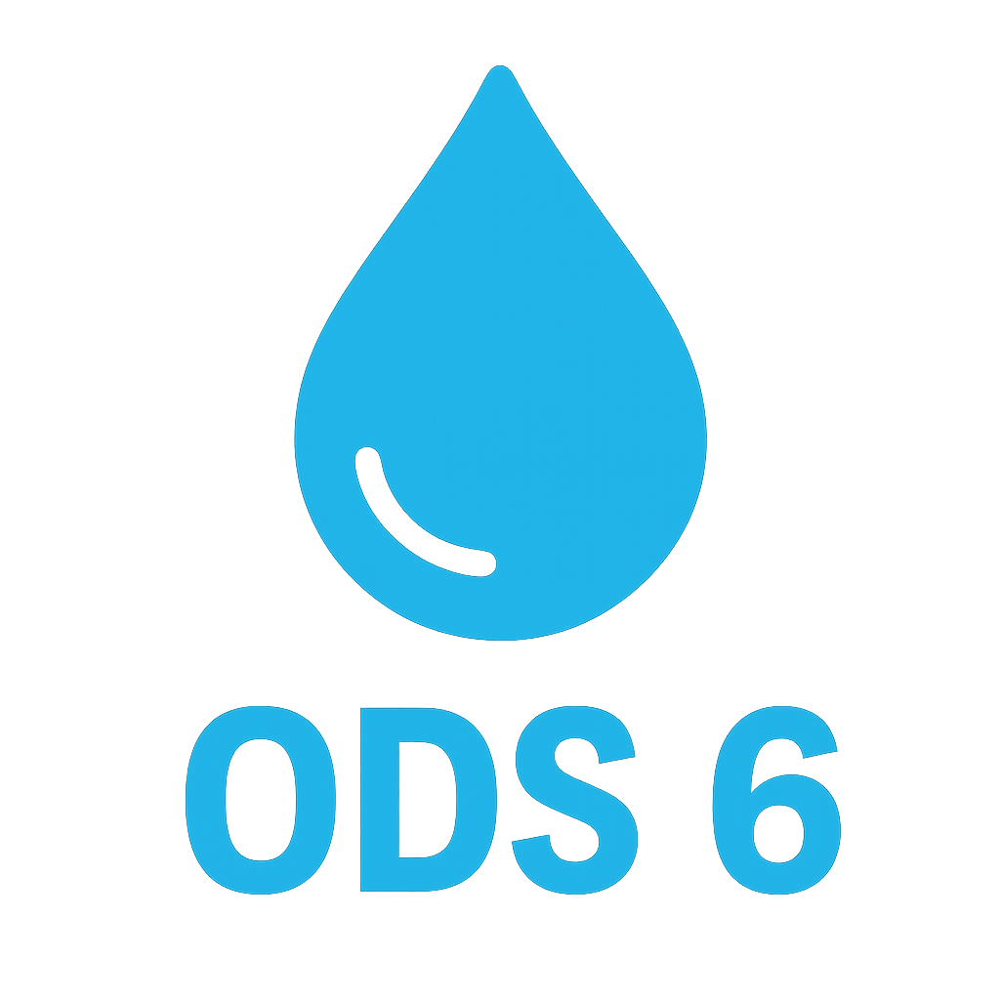

# Projeto ODS 6 - Água Potável

## Descrição

Este projeto é uma iniciativa educativa sobre o **Objetivo de Desenvolvimento Sustentável 6 (ODS 6)** da ONU, que busca garantir **disponibilidade e manejo sustentável da água e saneamento para todos**.  

O site contém informações sobre missões, projetos relacionados à água potável e uma área de feedback da comunidade, permitindo que visitantes compartilhem ideias e experiências.

---

## Funcionalidades

- **Seção Hero:** Apresentação visual com animação de frases.
- **Missões:** Cards interativos com quizzes e desafios sobre o uso consciente da água.
- **Projetos:** Cards de projetos domésticos, comunitários e educativos relacionados à água.
- **Feedback/Contato:** Formulário de envio de comentários que é direcionado para e-mail via Netlify Forms.
- **Responsivo:** Layout adaptável para desktops e dispositivos móveis.
- **Comentários em tempo real (versão antiga com Firebase):** Cada comentário tinha sistema de likes e armazenamento em tempo real.
  
---

## Tecnologias utilizadas

- **HTML5**
- **CSS3**
- **JavaScript (ES6)**
- **Netlify Forms** para envio de feedbacks por e-mail
- **Font Awesome** para ícones
- **Hospedagem:** Netlify

---

## Estrutura de arquivos

